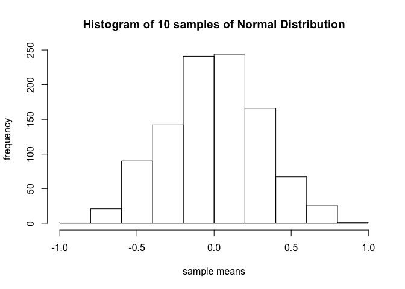
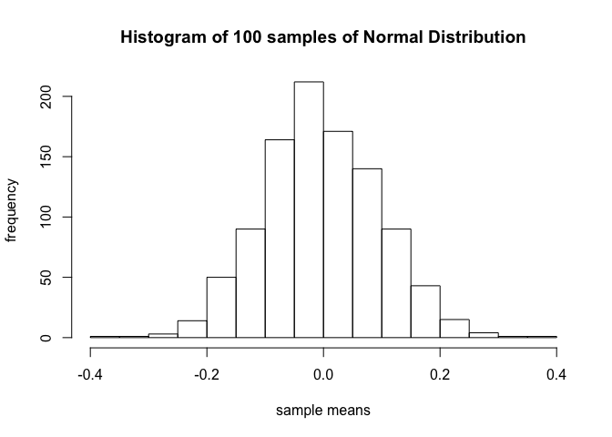
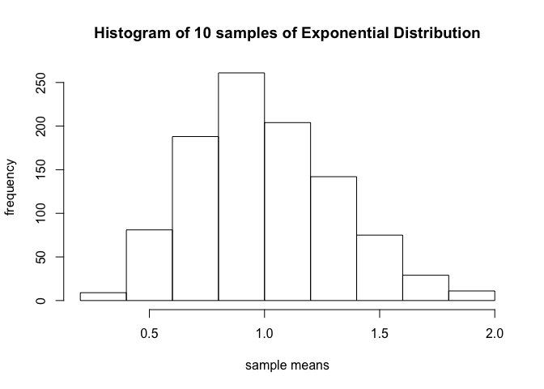
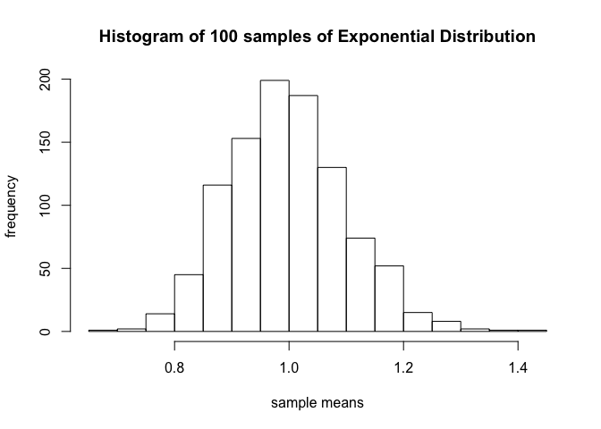

# homework4-central-limit-thm
Ramesh Simhambhatla  
October 21, 2016  
# Introduction
The purpose of this exercise is to demonstrate bootstrap code to illustrate the Central Limit Theorem in R markdown.

## Specifications
* a) Use a normal distribution with two different sample sizes and b) an exponential distribution with two different sample sizes. 
* Correct code alone is insufficient. Please also comment the code and explain the results. 
* The deliverable is a link to a GitHub repo containing the code. 


```r
library(graphics)
```

## A. Normal Distribution with two different sample sizes
Normal Distibution typically have mean=0, and standard deviation=1 for random
samples drawn from the population, the distribution of the sample means approximates that of a
distribution.

This exercise uses 1000 random samples with normal distribtuions of 10 and 100

### Bootstrap code with sample size 10 for 1000 random samples (normal distribution)

```r
n <-10                      # initialize sample, n=10
nsim <- 1000                # initialize number of simulations, nsim=1000
lotsa.means <- numeric(nsim) # cast the similuation data to numeric

#Loop through 1000 times and collect the mean of 10-mean normal distributions 
for (i in 1:nsim){ 
  x <- rnorm(n) 
  lotsa.means[i] <- mean(x) 
  } 
length(lotsa.means) # total number of means 
```

```
## [1] 1000
```

```r
summary(lotsa.means) # five number summary
```

```
##      Min.   1st Qu.    Median      Mean   3rd Qu.      Max. 
## -0.866100 -0.203000  0.002215  0.001779  0.208900  0.840500
```

```r
# plot histogram for vector of means
hist(lotsa.means, main=paste("Histogram of", n, "samples of Normal Distribution"), xlab="sample means", ylab="frequency")
```

<!-- -->

### Bootstrap code with sample size 100 for 1000 random samples (normal distribution)

```r
n <-100                     # initialize sample, n=100
nsim <- 1000                # initialize number of simulations, nsim=1000
lotsa.means <- numeric(nsim) # cast the similuation data to numeric

#Loop through 1000 times and collect the mean of 100-mean normal distributions 
for (i in 1:nsim){ 
  x <- rnorm(n) 
  lotsa.means[i] <- mean(x) 
  } 
length(lotsa.means) # total number of means 
```

```
## [1] 1000
```

```r
summary(lotsa.means) # five number summary 
```

```
##      Min.   1st Qu.    Median      Mean   3rd Qu.      Max. 
## -0.364700 -0.070030 -0.007448 -0.004316  0.064440  0.351000
```

```r
# plot histogram for vector of means
hist(lotsa.means, main=paste("Histogram of", n, "samples of Normal Distribution"), xlab="sample means", ylab="frequency")
```

<!-- -->

### Conclusion (for Normal Distribution with two different sample sizes):
The central limit theorm illustrates that, higher the size of random sample,the distribution of sample means is narrower. i.e., standard deviation is smaller. The mean of sample means will be closer to 0 in either case. The mean and standard deviation from the 'summary' output, and the distribtion of sample means from 'histogram' proves the central limit theorm.  

## B. Exponential Distribution with two different sample sizes
Exponentail Distibution typically log normal distribution with data is represented in positive values

This exercise uses 1000 random samples with normal distribtuions of 10 and 100

### Bootstrap code with sample size 10 for 1000 random samples (exponential distribution)

```r
n <-10                      # initialize sample, n=10
nsim <- 1000                # initialize number of simulations, nsim=1000
lotsa.means <- numeric(nsim) # cast the similuation data to numeric

#Loop through 1000 times and collect the mean of 10-mean exponetial distributions 
for (i in 1:nsim){ 
  x <- rexp(n) 
  lotsa.means[i] <- mean(x) 
  } 
length(lotsa.means) # total number of means 
```

```
## [1] 1000
```

```r
summary(lotsa.means) # five number summary
```

```
##    Min. 1st Qu.  Median    Mean 3rd Qu.    Max. 
##  0.2880  0.7789  0.9772  1.0030  1.2040  1.9680
```

```r
# plot histogram for vector of means
hist(lotsa.means, main=paste("Histogram of", n, "samples of Exponential Distribution"), xlab="sample means", ylab="frequency")
```

<!-- -->

### Bootstrap code with sample size 100 for 1000 random samples (normal distribution)

```r
n <-100                     # initialize sample, n=100
nsim <- 1000                # initialize number of simulations, nsim=1000
lotsa.means <- numeric(nsim) # cast the similuation data to numeric

#Loop through 1000 times and collect the mean of 100-mean exponential distributions 
for (i in 1:nsim){ 
  x <- rexp(n) 
  lotsa.means[i] <- mean(x) 
  } 
length(lotsa.means) # total number of means 
```

```
## [1] 1000
```

```r
summary(lotsa.means) # five number summary 
```

```
##    Min. 1st Qu.  Median    Mean 3rd Qu.    Max. 
##  0.6995  0.9305  0.9905  0.9969  1.0600  1.4000
```

```r
# plot histogram for vector of means
hist(lotsa.means, main=paste("Histogram of", n, "samples of Exponential Distribution"), xlab="sample means", ylab="frequency")
```

<!-- -->

### Conclusion (for Exponential Distribution with two different sample sizes):
The exercise illustrates that smaller sample mean exponential distribution is right skewed, however higher the size of sample, the distribution is normal and standard deviation is narrower. Mean of sample means in either case is almost 0.
